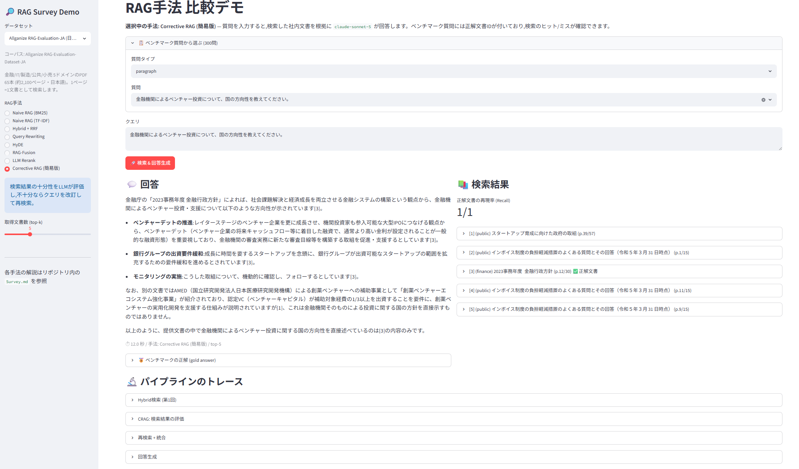
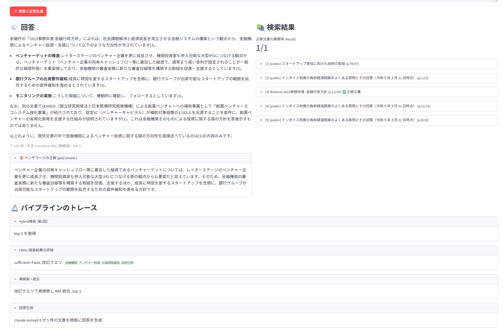
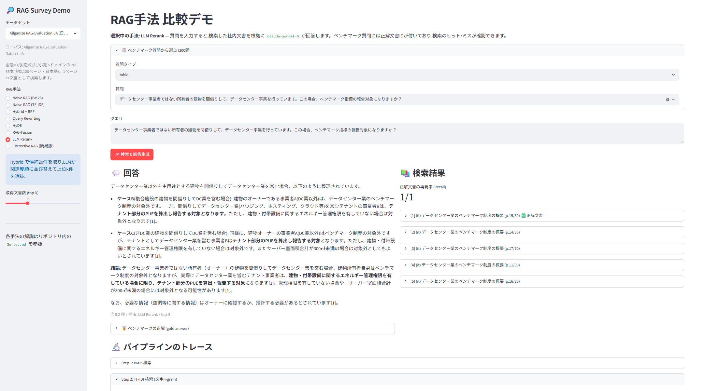

# 会話メモ









```
@README.md を読み，RAGのSurveyおよびデモアプリの作成を行って下さい．
```

30分くらい連続で動作して完成

```
すべて完了しました。README.md の依頼事項4点すべてに対応しています。

成果物

1. Survey.md — RAG手法の体系的Survey
Naive/Advanced/Modular のパラダイム分類から、検索器(BM25/Dense/Hybrid+RRF/ColBERT/リランク)、クエリ変換(Query Rewriting/HyDE/RAG-Fusion/Step-Back)、インデックス戦略(Small-to-Big/RAPTOR/Contextual Retrieval)、自己制御型(Self-RAG/CRAG/Adaptive-RAG/FLARE)、GraphRAG、Agentic RAG、評価手法までを長所・短所付きで整理し、16手法の比較表を付けました。

2. EnterpriseRAG-Bench で社内ドキュメント検索を再現
実在のベンチマーク(arXiv:2605.05253、GitHub、HuggingFace)から Confluence/Jira/GitHub の3ソース 19,361文書 と、それで完結する 178問(正解文書ID・正解回答付き)を data/ に取得しました。178問全問で検索器を評価した結果は BM25: Recall@5 = 0.604、TF-IDF: 0.562、Hybrid: 0.604 で、README に記載しています。

3. 主要RAG手法の実装(rag_core.py)— 8手法
Naive RAG (BM25 / TF-IDF)、Hybrid+RRF、Query Rewriting、HyDE、RAG-Fusion、LLM Rerank、Corrective RAG(簡易版)。生成は claude-sonnet-5 で、実APIでの動作確認済みです(引用付き日本語回答、正解文書ヒットも確認。thinking ブロック対応の修正も実施)。

4. Streamlit デモアプリ(app.py)
サイドバーで手法を選択し、クエリを入力(またはベンチマーク178問から選択)すると検索&回答生成を実行します。ベンチマーク質問では正解文書に✅マークと Recall 表示、gold answer との比較、パイプラインの中間ステップ(書き換え後クエリ、HyDE仮想文書、リランク順位など)のトレース表示ができます。AppTest でボタン押下→回答生成までのフルフローを検証済みです。

起動方法: .venv/bin/streamlit run app.py(APIキーは指定どおり .streamlt/secrets.toml から読みます。初回のみインデックス構築に約90秒、以降はキャッシュで数秒)

面白い観察として、semantic タイプの質問(例:「low bit math」→ 実文書では quantization)は語彙検索では正解文書を拾えず、モデルが「文書に記載なし」と正しく接地して答える様子がデモで確認できます。ベンチマークの狙いどおり、埋め込み検索やクエリ変換の価値が体感できる構成です。
```


/clear


```
@app.py では， EnterpriseRAG-Bench で様々な RAG 手法を動かすことが出来ます．
日本語のデータセットである Allganize RAG-Evaluation-Dataset-JA を実行したい．
```

```
完了しました。デモアプリのサイドバーに「データセット」セレクタが追加され、Allganize RAG-Evaluation-Dataset-JA (日本語) を選ぶと300問の日本語ベンチマークで全8手法が動きます。

やったこと

データセット構築 (build_allganize_ja.py 新規)
- HuggingFace のメタデータをもとに公開PDF 65本 (金融/IT/製造/公共/小売) をダウンロードし、pypdf で 1ページ=1文書 (2,126文書) として data/documents_allganize_ja.parquet に変換。質問300問は doc_id = "ファイル名#pページ" で正解ページに紐づけ、既存の Recall 表示がそのまま機能します
- リンク切れ5本は Wayback Machine から回収し、65本すべて・300問すべてを収録。PDFは data/allganize_ja_pdfs/ にキャッシュされ再実行は高速です
- ハマりどころ2件を解決: 暗号化PDF対応 (cryptography 追加) と、documents.csv 側ファイル名の NFD/NFC 不一致 (濁点の分解形) の正規化

rag_core.py
- DATASETS レジストリを追加し、Corpus / load_questions をデー は従来の英語データセットで後方互換)
- BM25 トークナイザを CJK文字バイグラム対応 に拡張 (形態素解析器なし)。英語コーパスのトークン化は従来と同一で、既存インデックスキャッシュもそのまま有効
- Query Rewriting / HyDE / RAG-Fusion / CRAG のプロンプトを、データセットの言語 (日本語クエリ生成) とドメイン説明に合わせて動的化

app.py
- サイドバー最上部にデータセット選択を追加。コーパス説明・質問一覧・プレースホルダが連動し、キャッシュはデータセット別に保持されます

動作確認済み
- 日本語のページ単位検索品質: BM25 Recall@5 = 25/30 (サンプル30問)、インデックス構築 約3秒
- 英語データセットの検索結果は変更前と同一挙動、Streamlit Appえ・描画も例外なし(回答生成はAPIキーが必要なため実行時に確認してください)

README.md と requirements.txt (requests / pypdf / cryptography) も更新済みです。
```

```
文書でおかしいところがあります．] (manufacturing) ベビーフード自主規格　第Ⅴ版 (p.11/17) ✅正解文書

doc_id: foodkaku5.pdf#p11 / score: 0.0284

/edGj0/edGj0/edGj0/edGj0/edGj0/edGj0/edGj0/edGj0/edGj0/edGj0/edGj0/edGj0/edGj0/edGj0/edGj0/edGj0/edGj0
/edGj0/edGj0/edGj0/edGj0/edGj0/edGj0/edGj0/edGj0/edGj0/edGj0/edGj0/edGj0/edGj0/edGj0/edGj0/edGj0/edGj0/edGj0/edGj0/edGj0/edGj0/edGj0/edGj0/edGj0/edGj0/edGj0/edGj0/edGj0/edGj0/edGj0/edGj0/edGj0/edGj0/edGj0/edGj0/edGj0/edGj0/edGj0/edGj0/edGj0/edGj0/edGj0/edGj0/edGj0
```


```
パイプラインのトレースでもっと動作がわかるようにしてください．
検索で得られた文書や，結果の統合方法，リランクのスコア，LLMへのインプットなど，詳しく追えるように改善して下さい．
```

```
完了しました。パイプラインのトレースを構造化し、各ステップで文書・スコア・統合内訳・LLM入出力まで追えるようにしました。実アプリでのエンドツーエンド実行 (Allganize JA + Hybrid + ベンチマーク質問) でも正しく描画されることを確認済みです。

トレースで見られるようになったもの

検索ステップ — 取得文書のテーブル (順位・スコア・doc_id・タイ エリのトークン列 (日本語は文字バイグラム)も表示されるので、「なぜこの文書が当たったか」が追えます。ベンチマーク質問の場合は各テーブルに ✅正解 列が付き、正解文書がどのステップで候補に入り/落ちたかを段階ごとに確認できます。

RRF統合 — 統合後の各文書について「BM25で何位 / TF-IDFで何位 → RRFスコア」の内訳テーブル。片方の検索器にしか出なかった文書はonでは5本のクエリ(元+派生4)それぞれの検索結果と、どのクエリの何位から最終結果に入ったかが見えます。

LLMを使うステップ (クエリ書き換え / HyDE / RAG-Fusion / リランク / CRAG評価 / 回答生成) — 📥 実際にLLMへ送ったプロンプト全文と 📤 生の出力を表示。回答生成では system プロンプト+文書コンテキスト全体 (入力文字数付き) が見られます。LLMリランクは「リランク後順位 ↔ 第1段順位」の対応表が付き、並び替えの効果が一目でわかります。

実装の要点

- rag_core.py: RAGTrace.add() を拡張し table / llm_in / llm_oetailed() が統合内訳を生成し、Corpus.search_hybrid(trace=...)が内部のBM25/TF-IDF/RRFを自動でトレースするので、Hybrid を使う5手法すべてに詳細が付きます
- app.py: ステップを Step N: 付きで番号表示し、テーブルは st.し付きコードブロック (8,000字超は省略表示) で描画

検証はモックLLMで全8手法のトレース構造を確認した後、実APIで HStep 1〜4の描画 (テーブル3つ+プロンプト/出力2つ)を確認しました。アプリを再起動すれば反映されます。
```


```
 RAG以外の設定（PDF読み取りツール，チャンク分割，ハイパーパラメータなど）をまとめてREADMEに記載して
```

```
README に「実験設定 (RAG手法以外の共通設定)」セクションを追加しました (「デモアプリで選べるRAG手法」と「Allganize〜について」の間)。4つの表にまとめています。

コーパス構築とチャンク分割 — データセット別に対比: PDF読み取りは pypdf (AES暗号化は cryptography で復号)、壊れたPDFは RapidOCR 日本語モデルでOCR (適用条件: 文書全体のCJK比率<5%で全ページ、通常文書でも本文20字未満のページは個別、pypdfium2 で2倍スケール描画)。チャンク分割は EN が「なし (1文書=1検索単位)」、JA が「1ページ=1チャンク」で、実測の平均文字数 (EN 約6,300字 / JA 約800字) も記載しました — 当初「約2,000字」と書きかけましたが実データで確認して修正しています。

トークナイズと検索器 — 英数字単語 + CJK文字バイグラムのトークナイザ (形態素解析なし)、BM25Okapi のデフォルト値 (k1=1.5, b=0.75, ε=0.25)、TF-IDF の char_wb 3〜4gram / max_features 10万 / sublinear_tf、インデッ

検索・統合のハイパーパラメータ — top-k (3〜10、デフォルト5)、RRF定数 k=60、Hybrid候補プール50件、RAG-Fusion のクエリ本数と各30件、LLMリランクの第1段20件 (本文300字提示)、CRAG評価の本文200字。

生成 (LLM) — claude-sonnet-5 を全タスク共通で使用、temperaturns=1500 で文書を各4,000字まで <document>タグ区切りで投入、補助タスクごとの max_tokens、クエリ変換の出力言語がデータセット言語に追従すること。

値はすべて rag_core.py / build_allganize_ja.py の定数と突き合わせてあるので、コードを変えたらこの表を更新すれば整合が保てます。
```


```
エラー  .venv/bin/streamlit run app.py
2026-07-04 11:04:04.064 Uvicorn server started on 0.0.0.0:8501

You can now view your Streamlit app in your browser.

Local URL: http://localhost:8501
Network URL: http://172.22.71.199:8501

2026-07-04 11:22:38.652 Serialization of dataframe to Arrow table was unsuccessful. Applying automatic fixes for column types to make the dataframe Arrow-compatible.
Traceback (most recent call last):
File "/home/itsuk/projects/RAG_Survey/.venv/lib/python3.12/site-packages/streamlit/dataframe_util.py", line 961, in convert_pandas_df_to_arrow_bytes
    table = pa.Table.from_pandas(df)
            ^^^^^^^^^^^^^^^^^^^^^^^^
File "pyarrow/table.pxi", line 4768, in pyarrow.lib.Table.from_pandas
File "/home/itsuk/projects/RAG_Survey/.venv/lib/python3.12/site-packages/pyarrow/pandas_compat.py", line 651, in dataframe_to_arrays
    arrays = [convert_column(c, f)
            ^^^^^^^^^^^^^^^^^^^^
File "/home/itsuk/projects/RAG_Survey/.venv/lib/python3.12/site-packages/pyarrow/pandas_compat.py", line 639, in convert_column
    raise e
File "/home/itsuk/projects/RAG_Survey/.venv/lib/python3.12/site-packages/pyarrow/pandas_compat.py", line 633, in convert_column
    result = pa.array(col, type=type_, from_pandas=True, safe=safe)
            ^^^^^^^^^^^^^^^^^^^^^^^^^^^^^^^^^^^^^^^^^^^^^^^^
File "pyarrow/array.pxi", line 390, in pyarrow.lib.array
File "pyarrow/array.pxi", line 91, in pyarrow.lib._ndarray_to_array
File "pyarrow/error.pxi", line 92, in pyarrow.lib.check_sta
pyarrow.lib.ArrowInvalid: ("Could not convert '-' with type str: tried to convert to int64", 'Conversion failed for column 初回 順位 with type object')
2026-07-04 11:24:20.398 Serialization of dataframe to Arrow table was unsuccessful. Applying automatic fixes for column types to make the dataframe Arrow-compatible.

File "/home/itsuk/projects/RAG_Survey/.venv/lib/python3.12/site-packages/streamlit/dataframe_util.py", line 961, in convert_pandas_df_to_arrow_bytes
    table = pa.Table.from_pandas(df)
            ^^^^^^^^^^^^^^^^^^^^^^^^
File "pyarrow/table.pxi", line 4768, in pyarrow.lib.Table.f
File "/home/itsuk/projects/RAG_Survey/.venv/lib/python3.12/site-packages/pyarrow/pandas_compat.py", line 651, in dataframe_to_arrays
    arrays = [convert_column(c, f)
            ^^^^^^^^^^^^^^^^^^^^
File "/home/itsuk/projects/RAG_Survey/.venv/lib/python3.12/compat.py", line 639, in convert_column
    raise e
File "/home/itsuk/projects/RAG_Survey/.venv/lib/python3.12/compat.py", line 633, in convert_column
    result = pa.array(col, type=type_, from_pandas=True, safe=safe)
            ^^^^^^^^^^^^^^^^^^^^^^^^^^^^^^^^^^^^^^^^^^^^^^^^^^^^^^
File "pyarrow/array.pxi", line 390, in pyarrow.lib.array
File "pyarrow/array.pxi", line 91, in pyarrow.lib._ndarray_to_array
File "pyarrow/error.pxi", line 92, in pyarrow.lib.check_sta
pyarrow.lib.ArrowInvalid: ("Could not convert '-' with type str: tried to convert to int64", 'Conversion failed for column 初回 順位 with type object')
```


```
直りました。原因は rrf_fuse_detailed の順位列で、両方の検索器にヒットした文書は整数、片方にしか出ない文書は "-" (文字列) を入れていたため、pyarrow が列を int64 に変換できず失敗していました (エラーが出ていた「初回 順位」列は CRAG の初回+再検索統合テーブルで、同じ関数由来です)。

順位列を文字列に統一する修正を入れ、BM25/TF-IDF の実データで Arrow 変換が通ることを確認済みです。表示上は従来どおり「1, 2, …」と「-」のままです。

Streamlit はソース変更を検知して次の操作時に再読み込みするので、ブラウザで再実行すればエラーログは出なくなります。
```


/clear


```
このフォルダではRAGのデモアプリを作成しています．現在はキーワード検索がメインですが，ベクトル検索も実行したい． multilingual-e5-smallを使用して下さい．
```

```
ベクトル検索の追加が完了しました。両データセットの埋め込みキャッシュも構築済みなので、streamlit run app.py を起動すればサイドバーの手法選択から即座に使えます。

変更内容

- rag_core.py — multilingual-e5-small によるベクトル検索器 Corpus.search_vector() を追加(クエリに query: 、文書に passage:  プレフィックス、正規化埋め込みの内積で類似度計算)。パイプラインに Naive RAG (ベクトル検索) と Hybrid (BM25+ベクトル) + RRF の2手法を新設し、計10手法になりました。既存手法は無変更です
- 埋め込みは初回計算後 data/*.e5.npy にキャッシュされ、python rag_core.py で事前構築も可能(両データセット分を構築済み: EN 29MB / JA 3.2MB)
- モデルと sentence-transformers は遅延ロードなので、キーワード検索だけ使う分には torch のロードは走りません
- requirements.txt に sentence-transformers 追記(venv にはCPU版 torch で導入済み)、.gitignore と README も更新

性能測定(Recall@5)

┌───────────────┬────────────┬────────────┐
│    検索器     │ EN (178問) │ JA (300問) │
├───────────────┼────────────┼────────────┤
│ BM25          │ 0.604      │ 0.857      │
├───────────────┼────────────┼────────────┤
│ ベクトル単体  │ 0.502      │ 0.793      │
├───────────────┼────────────┼────────────┤
│ BM25+ベクトル │ 0.608      │ 0.857      │
└───────────────┴────────────┴────────────┘

ベクトル単体は両データセットとも BM25 に及びませんでした(EN側は平均6,300字の文書を512トークンで切り詰める影響が大きい)。ただし誤り方がキーワード検索と異なるため、ハイブリッドにすると EN では BM25+TF-IDF(0.604)を上回る単体最良超えとなり、JA でも BM25 と同水準を維持します。この分析は README の性能表にも反映済みです。

改善の余地としては、EN側で文書をチャンク分割してから埋め込む、より大きいモデル(e5-base/large)を使う、などがあります。必要になったら声をかけてください。
```


githubで共有

```
埋め込みの事前構築などは省略できない？
```

```
埋め込みの事前構築を不要にして push しました。他の人のセットアップは「clone → 依存インストール → APIキー設定 → 起動」だけになり、40〜60分かかっていた手順が丸ごと消えました。

やったこと

- 構築済みの文書埋め込み data/*.e5.npy(EN 29MB + JA 3.2MB)をリポジトリに同梱(.gitignore から除外を解除)
- rag_core.py のキャッシュ有効性判定を mtime 比較から文書数の一致に変更しました。mtime のままだと clone 直後に npy が parquet より古いタイムスタンプになり、せっかく同梱しても再構築が走ってしまうためです。キャッシュヒット時 0.2秒で読み込めることを確認済みです
- README のセットアップ手順から事前構築ステップを削除し、「parquet を作り直したら対応する npy を削除する」という注意を追記

残る初回待ち時間(なくせないもの)

- BM25/TF-IDF インデックス構築: 初回起動時に約90秒(603MBあるので同梱は不可。2回目以降は数秒)
- 埋め込みモデル本体(約120MB): 初回のベクトル検索時に HuggingFace から自動ダウンロード(モデルの再配布はライセンス的にもサイズ的にも同梱しない方がよい)
```
